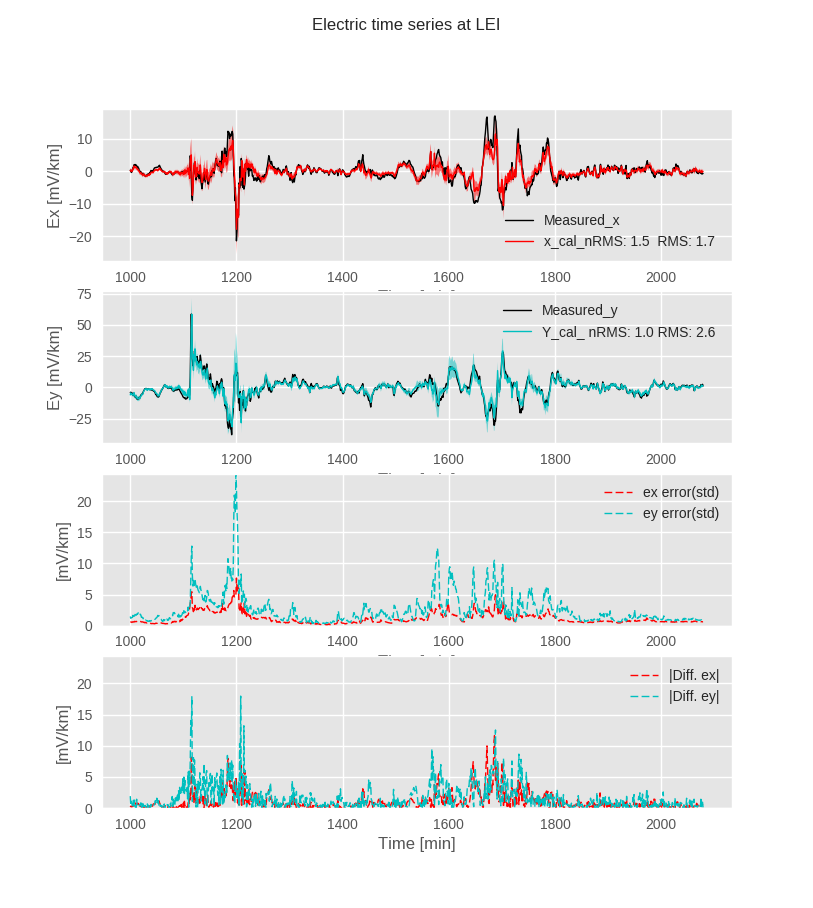
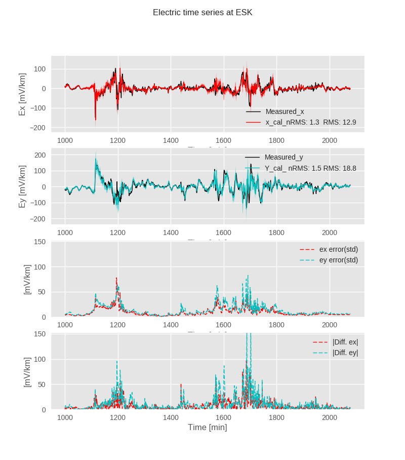

# Compute_GeoElectric_Fields

Code for modelling GeoElectric fields during geomagnetic storms based on: 1) magnetic measurements from magnetic observatories, and 2) geophysical parameters (i.e. electromagnetic tensor relationships).

This program was written by Joan Campanya i Llovet (of TCD) and Sean Blake (of TCD), and implemented and validated with data from Ireland and the UK (see Campanya et al., for more details). This code is a result of the IRC Enterpise partneship between UK Met Office and Trinity College Dublin. The project was in collaboration with British Geological Survey (BGS), and the Dublin Institute for Advanced Studies (DIAS).

## 0. Dependencies needed (*All python programs are written in Python 2.7*)

*numpy*

*pandas*

*matplotlib*

*scipy*

*seaborn*

*geopy*

*multiprocessing* (only to run it in parallel version)

## 1. Main Structure of the program:
The algorithm is divided in three folders:

a.  **in** folder. Contains the input data 

b.  **out** folder. contains sub-products created during the modelling, and the modelled geoelectric time series.

c.  **scr** folder. Contains the scripts used for modelling the geoelectric fields

## 1.1 *in* folder

This folder contains:
1.1.1. **data** folder with magnetic and electric time series, and tensor relationships (*TF* folder).

1.1.2. **Observatories.dat** file contains the name and coordinates, in degrees, of the magnetic observatories.

1.1.3. **Sites_interest.dat** file contains the name and coordinates in degrees of the sites of interest where we want to compute the geoelectric fields.

**For the program to work four main inputs need to be provided**

a) Time series from the magnetic observatories.
a.1) Time series are located within **data** folder with an additional folder with the name of the geomagnetic storm. On the exaple: **22-23_06_2015**.

a.2) Within the folder for a particular storm the geoelectric and geomagnetic time series are located in **B** and **E** folders, respectively. Note that the geoelectric time series are only used to compare the modelled geoelecric fields with the measured geoelectric fields.

a.3) Each component of either the geomagnetic or geoelectric time series is stored in a sepatate file.

b) Electromagnetic tensor relationships

b.1) The electromagnetic tensor relationships are located within **data** folder in the **TF** folder.

b.2) The tensor relationships relates time series measured at one site with time series measured at the same site or at a different site. The name of the files with the information of the tensor relationships is orgaised as: 1) Electric *E* or Magnetic *B* component of site 1 + 2) *Name of site 1* + 3) Electric *E* or Magnetic *B* component site 2 + 4) *Name of site 2* + *_s.j*. For example, the MT impedance tensor relating electrics and magnetics from the same site would be *ESITE1BSITE1_s.j*

b.3) The format of the files is the standard format from BIRRP processing code (j file, *http://www.complete-mt-solutions.com/mtnet/data/download_data.html*).

c and d) Data files with name and coordinates of magnetic observatories (*Observatories.dat*) and sites of interest (*Sites_interest.dat*). These files needs to be modified depending on the magnetic observatories that will be used for modelling the geoelectric fields, and the sites at where the geoelectric fields will be computed. Note that the related tensor relationships must be in the **TF** folder.

## 1.2 *out* folder

This folder contains sub-products created during the modelling, whithin **SECS** folder, and the computed electric time series specifying: 1) *name of the site*, 2) *component of the electric field*, 3) *storm*, and 4) *approach used to compute the electric fields*.

## 1.3 *scr* folder

This filder contains the main programs and an input file with the main parameters:

1.3.1.1. **EM_modelling.py**: Model electric and magnetic time series based on approaches presented by Campanya et al., (2018).

1.3.1.2. **functions_EM_modelling.py** contains all the functions requested by the program EM_modelling.py.

1.3.2.1. **EM_plotting.py**: Compares measured and modelled time series.

1.3.2.2. **functions_EM_plotting.py** contains all the functions requested by the program EM_plotting.py.

1.3.4.1. **SECS_interpolation.py** interpolates the magnetic fields between observatories using spherical elementary current systems.

1.3.4.2. **secs_pre.py** Contains functions and vairables requested for SECS_interpolation.py.

1.3.5. **inputs.py** contains all the inputs that need to be specified for modelling and plotting geoelectric fields. 

## NOTES
1) **inputs.py** is the only file that needs to be modified when all the necessary inputs (electromagnetic time series and electromagnetic tensor relationships) are at the selected folders. On the presented example, only the *main_path* in **inputs.py** will need to be modified and the example should run, first executing **EM_modelling.py** and then **EM_plotting.py**.

2) The current version is parallelised when computing SECS but only one CPU is selected. User should modify this in "SECS_interpolation.py" depending on the computing possibilities.

3) The provided code contains geoelectric and geomagnetic time series, so it can be tested. With the current set up (only having to modify the main path), results after executing EM_modelling.py and EM_plotting.py should be similar to Figures 1 and 2. Additional time series fo the same sites can be accessed from INTERMAGNET (www.intermagnet.org), Rosse observatory (http://www.rosseobservatory.ie/data), and the British Geological Survey (BGS)  http://www.geomag.bgs.ac.uk/data_service/space_weather/geoelectric.html). 

-------------------------------------------------------------------------------
# Figures

**Figure 1** Modelled geoelectric fields at Leitrim during 22-23/06/2015 geomagnetic storm following approach SECS-ITF. Results are compared with measured electric fields (in black).

**Figure 2** Modelled geoelectric fields at Leitrim during 22-23/06/2015 geomagnetic storm following approach SECS-ITF. Results are compared with measured electric fields (in black).
